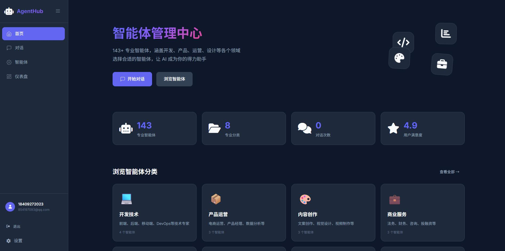
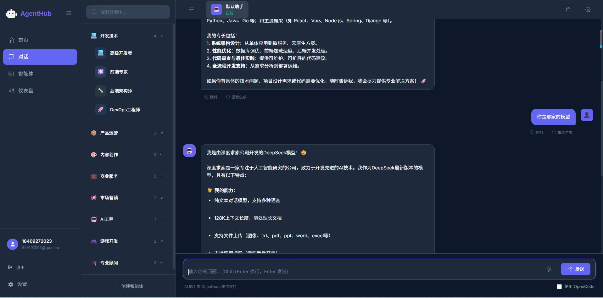
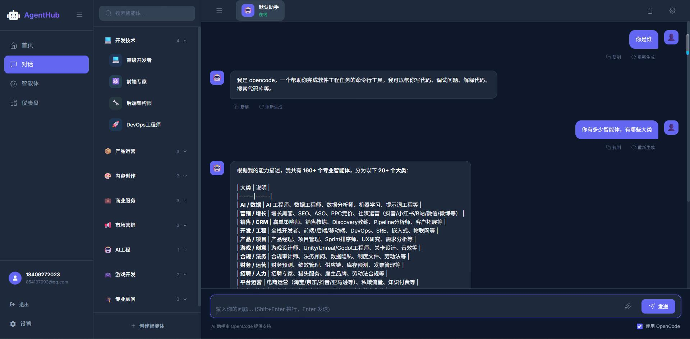

# AgentHub - OpenCode AI 数字员工管理中心

<div align="center">



*5 小时开发的 AI 数字员工管理中心*

</div>

## 项目背景

这是一个使用 Flask + OpenCode 构建的 AI 数字员工管理平台，**仅用 5 小时完成核心功能开发**。

> 灵感来源：利用 OpenCode 的 186 个专业智能体提示词模板，打造一个的现代化管理界面。

### 已知问题

⚠️ **OpenCode 回复可能不完整**：当前 OpenCode API 响应有时会出现空白回复，这是由于 OpenCode 服务本身的限制。项目已具备完整雏形，欢迎进行二次开发和优化。

### 界面预览

| 首页 | 登录 |
|:---:|:---:|
|  |  |

| DeepSeek 对话 | OpenCode 数字员工 |
|:---:|:---:|
|  |  |

## 产品概述

AgentHub 是一个基于 OpenCode 的 AI 数字员工（智能体）管理系统，提供现代化对话界面，同时支持分门别类地管理和使用 **186 个专业 AI 数字员工**。

> 每个数字员工就是一个对应岗位的提示词模板，通过 OpenCode 统一调度执行。

### 核心特性

- **186 个专业数字员工**: 覆盖开发、产品、运营、设计、营销等 20+ 领域
- **OpenCode 驱动**: 基于 OpenCode 的 MCP 架构，每个智能体对应一个专业提示词
- **现代化界面**: 类似 DeepSeek Chat 的深色主题对话界面
- **实时对话**: 支持 SSE 流式响应，实时显示 AI 回复
- **智能搜索**: 支持按名称、描述、关键词搜索数字员工
- **一键部署**: 快速搭建企业级 AI 数字员工平台

## 系统架构

```
┌─────────────────────────────────────────────────────────┐
│                     AgentHub Web UI                     │
│                  (Flask + Jinja2)                       │
│                  http://localhost:5000                  │
└─────────────────────┬───────────────────────────────────┘
                      │ API 调用
                      ▼
┌─────────────────────────────────────────────────────────┐
│              OpenCode API 服务                          │
│           (opencode serve --port 8080)                  │
│              http://localhost:8080                      │
└─────────────────────┬───────────────────────────────────┘
                      │ 智能体调度
                      ▼
┌─────────────────────────────────────────────────────────┐
│           agency-agents 数字员工库                      │
│     (174+ 专业岗位提示词模板)                           │
│     ├── engineering/     开发技术                       │
│     ├── marketing/       市场营销                       │
│     ├── product/         产品运营                       │
│     ├── sales/           销售团队                       │
│     └── ...              更多分类                       │
└─────────────────────────────────────────────────────────┘
```

## 安装


#### 1. 克隆项目

```bash
git clone https://github.com/Shybert-AI/agent-hub.git
cd agent-hub
```

#### 2. 安装依赖

```bash
pip install -r requirements.txt
```

#### 3. 安装 OpenCode

```bash
curl -fsSL https://opencode.ai/install | bash
source ~/.bashrc
```

#### 4. 安装 AI 数字员工库

```bash
# 下载 agency-agents 项目
git clone https://github.com/anomalyco/agency-agents-zh.git

# 转换数字员工格式为 OpenCode
cd agency-agents-zh
./scripts/convert.sh --tool opencode

# 安装到 OpenCode
./scripts/install.sh --tool opencode

# 复制配置到当前项目
cp -r .opencode ../agent-hub/
cd ../agent-hub
```

#### 5. 配置环境变量

编辑 `.env` 文件：

```bash
DEEPSEEK_API_KEY="your-api-key"
OPENCODE_API_URL="http://localhost:8080"
```

#### 6. 一键启动

```bash
./start.sh
```

## 使用方法

### 启动服务

```bash
./start.sh
```

服务启动后访问：
- **Web 界面**: http://localhost:5000
- **OpenCode API**: http://localhost:8080

### 验证数字员工

在 Web 界面输入：`你有多少智能体？`

或通过 OpenCode CLI：

```bash
# 输入：你有多少智能体？
```


### 停止服务

```bash
./stop.sh
```

## 数字员工分类

| 分类 | 数量 | 示例角色 |
|------|------|----------|
| 开发技术 | 20+ | 前端开发者、后端架构师、DevOps工程师 |
| AI工程 | 15+ | 模型训练师、数据工程师、MLOps专家 |
| 产品运营 | 20+ | 产品经理、增长黑客、数据分析师 |
| 市场营销 | 25+ | SEO专家、社媒运营、广告投放师 |
| 销售团队 | 15+ | 售前工程师、销售教练、投标策略师 |
| 商业服务 | 20+ | 财务分析师、供应链专家、法务顾问 |
| 游戏开发 | 15+ | 游戏设计师、关卡设计师、技术美术 |
| 专业顾问 | 30+ | 各细分领域专家 |

## 技术栈

### 后端
- **Framework**: Flask 3.0
- **Database**: SQLite (Flask-SQLAlchemy)
- **AI Integration**: DeepSeek API + OpenCode

### 前端
- **Template**: Jinja2
- **Styling**: CSS3 (自定义变量系统)
- **JavaScript**: ES6+ (原生)

## 项目结构

```
agent-hub/
├── app/
│   ├── models/          # 数据模型
│   ├── routes/         # 路由 (main, api, agents, auth)
│   ├── services/       # 服务层
│   ├── templates/      # HTML 模板
│   └── static/         # 静态资源
├── .opencode/          # OpenCode 数字员工配置 (从 agency-agents 复制)
├── scripts/
│   ├── convert.sh     # 数字员工转换脚本
│   └── install.sh     # 数字员工安装脚本
├── config/
├── logs/
├── app_v1.py           # Flask 应用入口
├── start.sh           # 启动脚本
├── stop.sh            # 停止脚本
├── requirements.txt
└── README.md
```

## API 接口

| 方法 | 端点 | 描述 |
|------|------|------|
| GET | /api/agents | 获取所有数字员工 |
| GET | /api/agents/:id | 获取单个数字员工 |
| GET | /api/agents/categories | 获取所有分类 |
| POST | /api/chat | 发送消息（SSE 流式） |

## 界面预览

### 1. 首页 (/)
- Hero 区域 + 统计卡片
- 分类快速导航
- 热门数字员工推荐

### 2. 对话页面 (/chat)
- 左侧边栏：数字员工分类导航
- 中央聊天区：消息列表 + 输入框
- Markdown 渲染 + 代码高亮
- 流式响应显示

### 3. 数字员工管理 (/agents)
- 筛选工具栏
- 数字员工卡片网格
- 使用统计

## 生产部署

### 使用 Gunicorn

```bash
gunicorn -w 4 -b 127.0.0.1:5000 "app_v1:create_app()"
```

### 使用 Docker

```dockerfile
FROM python:3.11-slim
WORKDIR /app
COPY requirements.txt .
RUN pip install -r requirements.txt
COPY . .
EXPOSE 5000
CMD ["./start.sh"]
```

## 未来规划

- [x] 用户认证系统
- [x] 对话历史持久化存储
- [x] 174+ 专业数字员工
- [x] OpenCode 集成
- [ ] 自定义数字员工市场
- [ ] API 限流和配额管理
- [ ] 多语言支持
- [ ] WebSocket 实时通信

## 参与贡献

欢迎提交 Issue 和 Pull Request！

- 🐛 发现 Bug？请提交 [Issue](https://github.com/your-repo/agent-hub/issues)
- 💡 有新想法？欢迎提交 Feature Request
- 🔧 想二次开发？Clone 后尽情发挥
- 📝 完善文档？PR 大欢迎！

## License

MIT License
